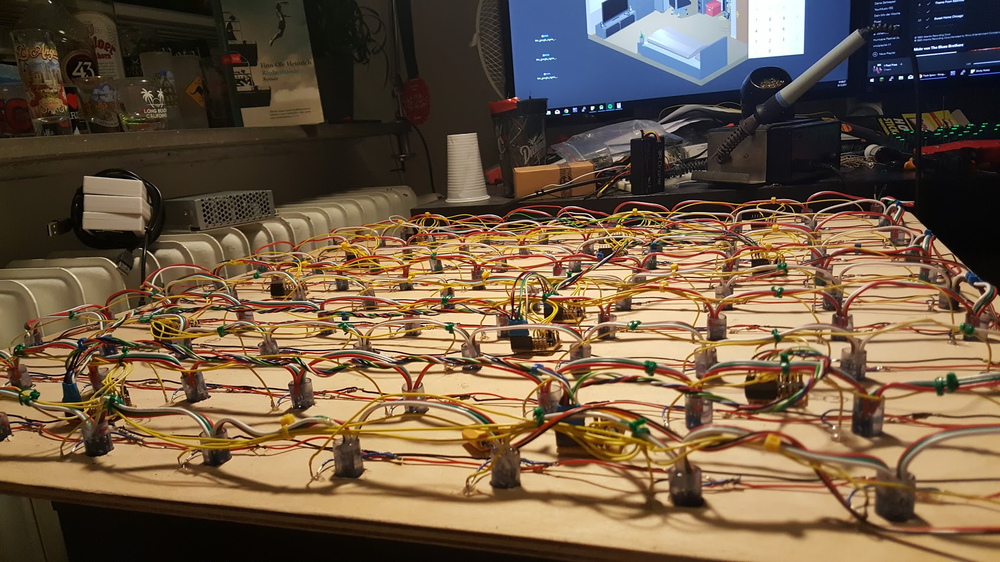

# Matrix-Led-Table-Controller
This is a software I wrote to control a led table I build. The software is written in C# and runs on a raspberry pi that is connected to a fade candy. The software supports runnings Applications (basically little classes), connecting via a Webpage & Websockets, a game pad like a nes controller or controlling an application like a game over the mobile phone browser.

If you have plans to build something similar youself or you have any questions about the project and/or the software (because it is not very well documented) please do not hestitate to contact me at uelstudios@gmail.com. I will be happy to help you.

If you do not have a real led table but you would like to run the software you can do so. The software includes different "renderers". A renderer defines how the output (basically an image with 10 by 10 pixels) is displayed. You can output it to a console, send it over ethernet, send it to the serial output or just send it to a fade candy.

Also the software is very modular. It is super easy to add new modules like an application or a new renderer.

Note that animations are currently not supported. A work around is to just build an application that renders different frames on an animation. This is not very complicated.

# Parameters:
  - mute        Mute an output channel in the console. (default: none)
  - com         Com port for arduino communication for touch sensors. (default: COM5)
  - baud        Baud rate for arduino communication (default: 57600)
  - renderer    The renderer to use (default: fadecandy)
  - app         The app to run on startup (default: idle)
  
# Commands
Note that you will have to possibility to run commands. Type "help" to learn more.
  - help/?              Get help
  - exec [command]      Execute a command on the communication server.
  - log [msg]           Add to logs
  - whoami              Who is running this software
  - uptime              Time the software is running
  - tcp [msg]           Send a message over tcp
  - ws [msg]            Send a message over web sockets
  - echo [msg]          Print to console
  - clear               Clear console
  - beep                Play sound on host
  - status              Get status/state of software
  - shutdown            Shutdown the host
  - '.'                 Repeat last command
  - exit                Exit the software
  
Just try to run them and you will learn what they will do.

# Troubleshooting:
  - The application will crash on startup if there is no fade candy server listening on "127.0.0.1:7890". If you do not want to use a face candy you have to set the "-renderer" parameter.

# Look at the pictures to get an idea of the project!

Fertiger Tisch

Video einer Zeichen-App
[Video Ansehen](images/draw.mp4)

Unterseite

# Thank you for looking at my project.
I would like to mention that you are not allowed to use this software commercially without my consent.

If you use this software for a personal project or you just want to say something I would like to hear from you!
